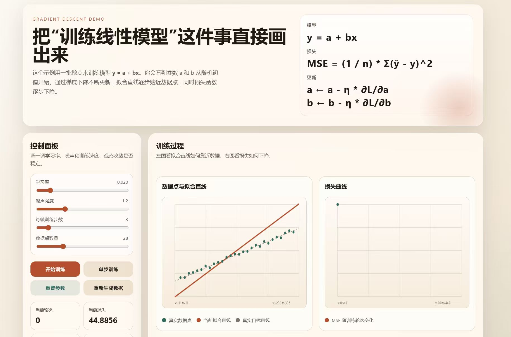

# 🎣 钓鱼塘大学 · 机器学习入门游戏

> 把 MSAI 300《人工智能基础》第二讲的全套概念，翻译成一个 30 岁打工人玩得动的钓鱼游戏。
> 不堆公式，全部用"装备""KPI""卷王"这种班味词替换抽象 ML 术语。

**🌐 在线试玩 · https://ai.hutiefang.com/**

---

## 这是什么

一个**单文件 HTML 的可玩教学小站**，配合北方某校 MSAI 300《人工智能基础》第二讲（机器学习基础）使用。

两个版本并列：

| 版本 | 入口 | 用途 |
| --- | --- | --- |
| 🎣 **钓鱼游戏版** | `index.html` | 给学生 / 30 岁打工人自己玩，沉浸式过完所有 ML 概念 |
| 📐 **教学讲解版** | `classic.html` | 给老师上课用，规规矩矩的可视化（同学原作 + URL 同步增强） |

两个版本通过 **URL hash 同步参数**——在一边调出来的拟合直线 a/b，点顶部跳转可以原样带到另一边。

## 截图



## 游戏三阶段（严格按 PPT 三类超参数）

```
① 渔具店 (config) ──→ ② 钓鱼场 (training) ──→ ③ 战绩评定 (metrics)
```

### ① 渔具店

按 PPT 第 6-7 页《基本概念》把超参数分成 3 类 + 1 个评估项：

- **🗺️ A. 数据准备**：鱼塘地图（线性/二次/三次）、鱼群规模、噪声、train/test 拆分、数据增强
- **🎣 B. 模型设定**：多项式次数 1-15
- **⚙️ C. 模型训练**：学习率 η、max epoch、early stopping
- **🛡️ D. 防过拟合**：L1 正则、L2 正则、Dropout（PPT 第 17-19 页那张红字装备清单）
- **🎯 E. 评判标准**：MSE / Accuracy / Precision / Recall / F1 + 钓中阈值 ε

附 4 个一键预设：`🌱 新手村 / 🌀 弯曲挑战 / 🪤 过拟合诊所 / 🛡️ 防御工事`。

### ② 钓鱼场

- 鱼塘 Canvas（含训练鱼 / 测试鱼 / 数据增强鱼 / 真实分布虚线）
- 双曲线对比图（学习曲线 + 验证曲线 · PPT 第 13、14 页）
- 现场可调学习率 / 早停开关
- 收敛 / 早停 / 过拟合 / 学习率发散 等情况都有喵老板文案提示

### ③ 战绩评定

- 大段位评语（CTO 喵 → 摸鱼候选人）
- **4 个 PPT 性能指标卡**：Accuracy / Precision / Recall / F1（含公式）
- **混淆矩阵**（TP / FP / FN / TN · PPT 第 49-50 页可视化）
- 完整训练记录

## PPT 严格对标表

| 游戏元素 | ML 术语 | PPT 出处 |
| --- | --- | --- |
| 鱼竿节数 | 多项式次数 / 模型复杂度 | 第 7 页 |
| 急性子程度 | 学习率 η | 第 9 页 |
| 摸鱼模式 | 梯度下降 | 第 11 页 |
| KPI 损失 | MSE 经验风险 | 第 12 页 |
| 划测试鱼塘 | Train / Test Split | 第 13 页 |
| 早收工开关 | Early Stopping | 第 17 页 |
| L1 / L2 参数管制 | L1 / L2 Regularization | 第 18 页 |
| Dropout 随机失活 | Dropout | 第 19 页 |
| 学习/验证曲线对比 | Learning / Validation Curve | 第 15-16 页 |
| 钓中率 | Accuracy | 第 47 页 |
| 精确率 / 召回率 / F1 | Precision / Recall / F1 | 第 48-53 页 |
| 混淆矩阵 | Confusion Matrix | 第 49-50 页 |

游戏右下角"📖 游戏术语 ↔ ML 术语 全对照"卡片里有完整版。

## 本地预览

```bash
# 任选其一
python3 -m http.server 8000
npx serve .
```

打开 http://localhost:8000

## 部署到腾讯云

仓库里有完整的部署脚本和配置：

| 文件 | 用途 |
| --- | --- |
| `ai.hutiefang.com.conf` | 当前生产环境的 OpenResty 站点配置（1Panel + Let's Encrypt） |
| `nginx.conf` | 通用 Nginx 配置模板（CVM 自建场景） |
| `deploy-cos.sh` | 腾讯云 COS 静态托管一键上传脚本 |
| `404.html` / `favicon.svg` | 错误页 + 站点图标 |

### 方案 A · 腾讯云 COS 静态托管（最便宜）

```bash
pip install coscmd
coscmd config -a <SecretId> -s <SecretKey> -b <Bucket> -r <Region>
chmod +x deploy-cos.sh && ./deploy-cos.sh
```

### 方案 B · CVM / 轻量服务器 + 1Panel + OpenResty

参考 `ai.hutiefang.com.conf`：

1. 把 `index.html` / `classic.html` / `404.html` / `favicon.svg` 放到 OpenResty 容器挂载的 `/www/sites/<site>/`
2. 把 `ai.hutiefang.com.conf` 改成你的域名后丢进 `/opt/1panel/www/conf.d/`
3. `docker exec <openresty-container> openresty -t && docker exec <openresty-container> openresty -s reload`

## 文件结构

```
.
├── index.html              # 🎣 钓鱼游戏 v3（带渔具店 + 战绩页）
├── classic.html            # 📐 教学讲解版（同学原作 + 跨页跳转增强）
├── favicon.svg             # 站点图标
├── 404.html                # 404 自定义页
├── ai.hutiefang.com.conf   # OpenResty 生产配置
├── nginx.conf              # 通用 Nginx 模板
├── deploy-cos.sh           # 腾讯云 COS 部署脚本
├── docs/
│   └── screenshots/
│       └── classic-preview.jpg
└── README.md
```

## 致谢

- **教学讲解版（classic.html）** 由同学完成原型；本项目在其上加了顶栏切换 + URL hash 同步参数。
- **钓鱼游戏版（index.html）** 由 Claude Code 配合作者完成，严格对标第二讲 58 页 PPT。

## License

教学用途，自由使用。
